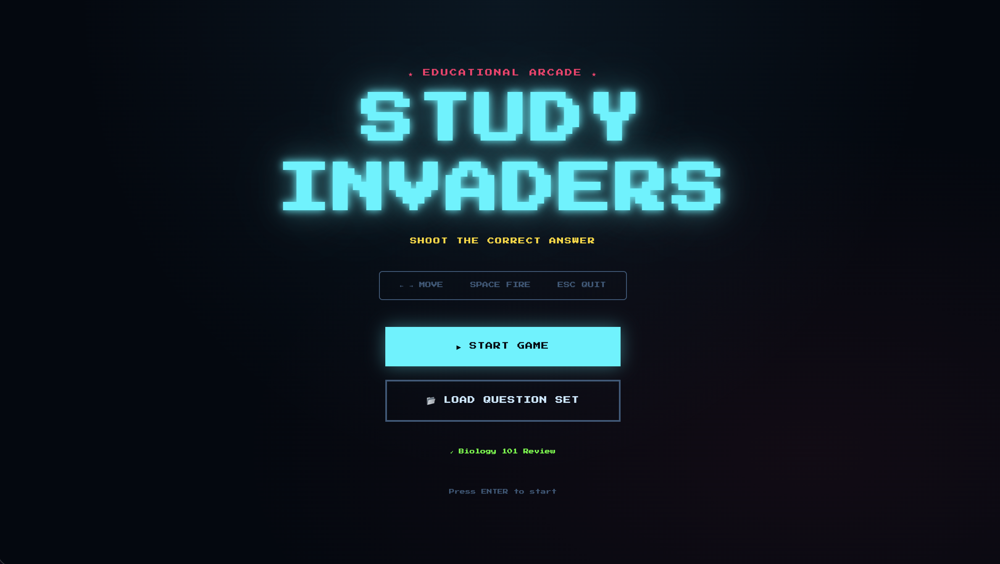

# 🚀 Study Invaders

> **NAU AI Hub — Experimental Learning Project**
> A retro space shooter where the enemies *are* your study material.



---

## What Is This?

Study Invaders is a browser-based **Galaga-style arcade game** built for active recall studying. Instead of passive flashcards, you shoot down the correct answer before the wrong ones reach your ship.

The twist: **question sets are plain JSON files** — which means any student can generate a custom set using AI (ChatGPT, Claude, etc.), drop it into the game, and start shooting.

This project lives in the **NAU AI Hub** as an experiment in:
- AI-assisted content creation (students generate their own question sets)
- Community-driven learning (share sets with classmates)
- Rapid iteration based on student feedback

---

## Quick Start

### Run Locally (GitHub Codespaces or any machine with Node/Python)

```bash
# Clone the repo
git clone https://github.com/YOUR_USERNAME/study-invaders.git
cd study-invaders

# Serve with Python (simplest)
python3 -m http.server 8080

# OR with Node
npx serve .
```

Then open `http://localhost:8080` in your browser.

### Publish for Free (GitHub Pages)

1. Push all files to a GitHub repo
2. Go to **Settings → Pages → Source: main / (root)**
3. Save — your game is live at `https://YOUR_USERNAME.github.io/study-invaders/`

---

## How to Play

| Key | Action |
|-----|--------|
| `← →` | Move ship left / right |
| `Space` | Fire missile / Skip question card |
| `Esc` | Open quit menu |
| `Enter` | Confirm / Start game |

**Goal:** A question appears at the top. Enemy blocks fall — each one shows an answer choice. Shoot the **correct answer** before it reaches the bottom. Wrong shots cost a life. Three lives total.

---

## File Structure

```
study-invaders/
├── index.html              # Game UI & screens
├── style.css               # Retro CRT visual style
├── game.js                 # All game logic (Canvas, sound, state machine)
├── README.md               # This file
└── questions/
    ├── sample.json         # Default question set (loads on startup)
    ├── ds_stack_queue_deque.json
    ├── discrete_math.json
    ├── bio182.json
    ├── algorithms_big_o.json
    └── general_cs.json
```

---

## Creating Your Own Question Set with AI

This is the core experiment. Use any AI assistant to generate a question set for your class.

### Prompt Template (copy & paste into Claude or ChatGPT)

```
Create a Study Invaders question set for [YOUR SUBJECT / TOPIC].

Output ONLY a valid JSON file in exactly this format:

{
  "title": "Short descriptive title",
  "questions": [
    {
      "prompt": "Question text here?",
      "choices": ["Option A", "Option B", "Option C", "Option D"],
      "answerIndex": 1,
      "explain": "One sentence explaining why this answer is correct."
    }
  ]
}

Rules:
- 10–25 questions
- 3–4 choices per question (no more than 4)
- answerIndex is 0-based (0 = first choice)
- Keep choice text SHORT (under ~40 characters each)
- explain is optional but strongly encouraged
- Focus on commonly confused or tricky concepts
- Output raw JSON only, no extra text
```

**Example prompts that work well:**
- *"Create a question set for BIO 182 covering cell respiration and DNA replication"*
- *"Make 15 questions on Stack vs Queue vs Deque data structures — focus on edge cases"*
- *"Quiz me on Discrete Math: logic, set theory, and modular arithmetic. Emphasize things students confuse"*

### Load Your Set Into the Game

**Option A — Drag & Drop at Runtime:**
Click **📂 LOAD QUESTION SET** on the start screen and select your `.json` file. No restart needed.

**Option B — Add to the Repo:**
Drop your `.json` file into the `questions/` folder and commit. It's now permanently available.

---

## Sharing Question Sets

The goal is a **community-shared library** of question sets.

To share your set with classmates:
1. Add your `.json` file to `questions/` in the repo
2. Open a **Pull Request** with a short description (subject, course number, what it covers)
3. Once merged, everyone playing from the repo gets your questions

**Naming convention:** `SUBJECT_TOPIC.json`
Examples: `cs249_linked_lists.json`, `bio182_genetics.json`, `mat226_graph_theory.json`

---

## Included Question Sets

| File | Subject | Topics | Questions |
|------|---------|--------|-----------|
| `sample.json` | BIO 101 | Cell biology basics | 8 |
| `ds_stack_queue_deque.json` | CS — Data Structures | Stack, Queue, Deque, BFS/DFS | 15 |
| `discrete_math.json` | MAT — Discrete Math | Logic, sets, proofs, modular arithmetic | 15 |
| `bio182.json` | BIO 182 | Cell respiration, DNA, genetics, H-W | 15 |
| `algorithms_big_o.json` | CS — Algorithms | Big-O, sorting, time complexity | 10 |
| `general_cs.json` | CS — Fundamentals | Pointers, recursion, Git, OOP, SQL | 10 |

---

## Question Set Format Reference

```json
{
  "title": "Human-readable title shown in the UI",
  "questions": [
    {
      "prompt": "What does LIFO stand for?",
      "choices": [
        "Last In, First Out",
        "Last In, First Over",
        "List In, Function Out",
        "Linear Input, First Output"
      ],
      "answerIndex": 0,
      "explain": "LIFO = Last In First Out. The last item pushed is the first item popped — like a stack of plates."
    }
  ]
}
```

**Rules:**
- `choices` → 2–4 items (4 recommended)
- `answerIndex` → 0-based index into `choices`
- `explain` → optional, shown after correct answer. Keep it to 1–2 sentences.
- Keep individual choice text under ~50 characters so it fits in the enemy block

---

## Contributing & Feedback

This is an **AI Hub experiment** — your feedback directly shapes what gets built next.

**Ways to contribute:**
- Submit new question sets via Pull Request
- Open a GitHub Issue with bugs, suggestions, or feature requests
- Use the game in your study sessions and report what works / what doesn't

**Ideas on the roadmap (based on student feedback):**
- [ ] Leaderboard / score sharing
- [ ] Multiple game modes (timed, survival, boss rounds)
- [ ] In-browser question set editor / AI generator
- [ ] Mobile touch controls
- [ ] Multiplayer (same question, race to shoot first)

---

## Technical Notes

Built with zero dependencies — plain HTML, CSS, and JavaScript Canvas. No build step, no framework, no npm install required to play. Sound effects are generated entirely with the Web Audio API (no audio files).

To modify difficulty, edit the `CONFIG` object at the top of `game.js`:

```js
const CONFIG = {
  lives: 3,
  baseEnemySpeed: 55,      // px/sec — increase to make it harder
  speedScalePerN: 5,       // correct answers per speed increase
  speedScaleAmount: 0.12,  // 12% faster each level
  readDuration: 3.0,       // seconds to read question card
  feedbackDuration: 1800,  // ms to show correct/wrong feedback
};
```

---

## License

MIT — free to use, modify, and distribute. If you build something cool with it, share it back with the Hub.

---

*Built by Lareine Han · NAU AI Hub*